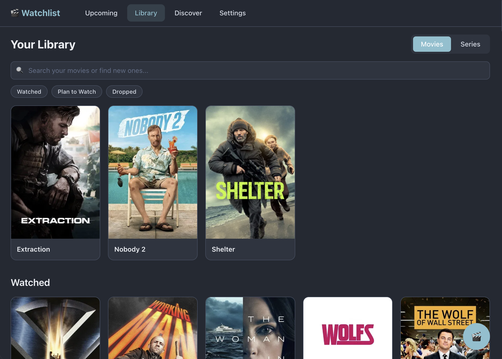
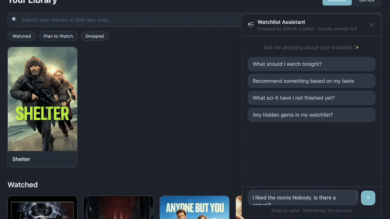

# Watchlist — Movie & Series Tracker

A responsive React web app to track movies and series you've watched, discover upcoming releases with countdown timers, find where to watch content, and get personalized AI recommendations.



## Features

- **Upcoming** — Browse upcoming movies & series with live "X days" countdown badges
- **Library** — Track your watched/watching/plan-to-watch movies & series with ratings, notes, and series progress
- **Discover** — Trending movies & series from TMDB
- **Detail Pages** — Rich metadata: poster, backdrop, overview, cast & crew, where to watch (streaming/rent/buy)
- **Search** — Search TMDB from the library page to find and add new content
- **AI Copilot** — Personalized movie & series recommendations powered by the GitHub Copilot SDK, with full access to your library context
- **Export / Import** — Back up and restore your library as JSON
- **Responsive** — Mobile-first design with bottom nav on mobile, top nav on desktop

## Tech Stack

**Frontend**
- React + TypeScript + Vite
- Tailwind CSS v4
- TanStack Query (React Query)
- React Router v7

**Backend**
- Node.js + Express
- better-sqlite3 (SQLite) for local persistence
- GitHub Copilot SDK for AI chat
- Zod for schema validation

## GitHub Copilot SDK

The AI chat feature is built on the [`@github/copilot-sdk`](https://www.npmjs.com/package/@github/copilot-sdk) package. On startup, the Express server initialises a `CopilotClient` and exposes a streaming chat API that the frontend consumes via Server-Sent Events.



Key integration points:

- **Session creation** (`POST /api/chat/session`) — creates a `CopilotSession` with the user's full library injected as system context, so the model can give personalised recommendations without hallucinating titles already in the watchlist.
- **Streaming responses** (`POST /api/chat/message`) — uses `session.on('assistant.message_delta', ...)` to stream tokens to the client in real time.
- **Tool use** (`server/tools.ts`) — the session is configured with TMDB tools defined via `defineTool` and Zod schemas. The model calls these automatically to fetch live data instead of relying on stale training data:

  | Tool                 | Parameters                                            | Description                                                                                                                                 |
  | -------------------- | ----------------------------------------------------- | ------------------------------------------------------------------------------------------------------------------------------------------- |
  | `searchTMDB`         | `query: string`, `type: "movie" \| "tv"`              | Search for movies or TV series by title/keywords. Returns up to 6 results with ID, title, overview, release date, vote average, and genres. |
  | `getTMDBDetails`     | `id: number`, `type: "movie" \| "tv"`                 | Fetch full metadata for a title by TMDB ID, including genres, tagline, runtime, status, and top 5 cast members.                             |
  | `getSimilar`         | `id: number`, `type: "movie" \| "tv"`                 | Get up to 8 titles similar to a given TMDB ID. Useful for franchise and sequel exploration.                                                 |
  | `getRecommendations` | `id: number`, `type: "movie" \| "tv"`                 | Get up to 8 personalised TMDB recommendations based on a specific title.                                                                    |
  | `searchPerson`       | `name: string`                                        | Search for an actor, director, or crew member by name. Returns TMDB person ID, department, and known-for titles.                            |
  | `getPersonCredits`   | `personId: number`, `type: "movie" \| "tv" \| "both"` | Retrieve up to 20 most recent movie and/or TV credits for a person by their TMDB person ID.                                                 |

## Getting Started

```bash
# 1. Get a TMDB API key:
#    - Sign up at https://www.themoviedb.org/signup
#    - Go to Settings → API → Create → Developer
#    - Copy the "API Read Access Token" (v4 bearer token)

# 2. Create .env file:
cp .env.example .env
# Edit .env and paste your token

# 3. Install & run:
npm install
npm run dev
```

`npm run dev` starts both the Vite dev server and the Express backend concurrently.

## Project Structure

```
src/
├── api/          # TMDB API client + React Query hooks
├── db/           # Data models + REST API hooks (library, progress, episodes)
├── components/
│   ├── layout/   # AppShell (top/bottom nav)
│   ├── ui/       # Card, CardGrid, SearchBar, Filters, etc.
│   └── detail/   # HeroBanner, Overview, CastCrew, WatchProviders
├── pages/        # Route-level pages
├── hooks/        # useCountdown, useDebounce, useSettings
└── utils/        # Date helpers, image URL builders, constants

server/
├── index.ts      # Express app + REST API routes + Copilot SDK chat endpoints
├── db.ts         # better-sqlite3 database setup, schema, and prepared statements
└── tools.ts      # Copilot SDK tool definitions (TMDB search, details, recommendations)

data/
└── movie-tracker.db  # SQLite database file (auto-created on first run)
```
