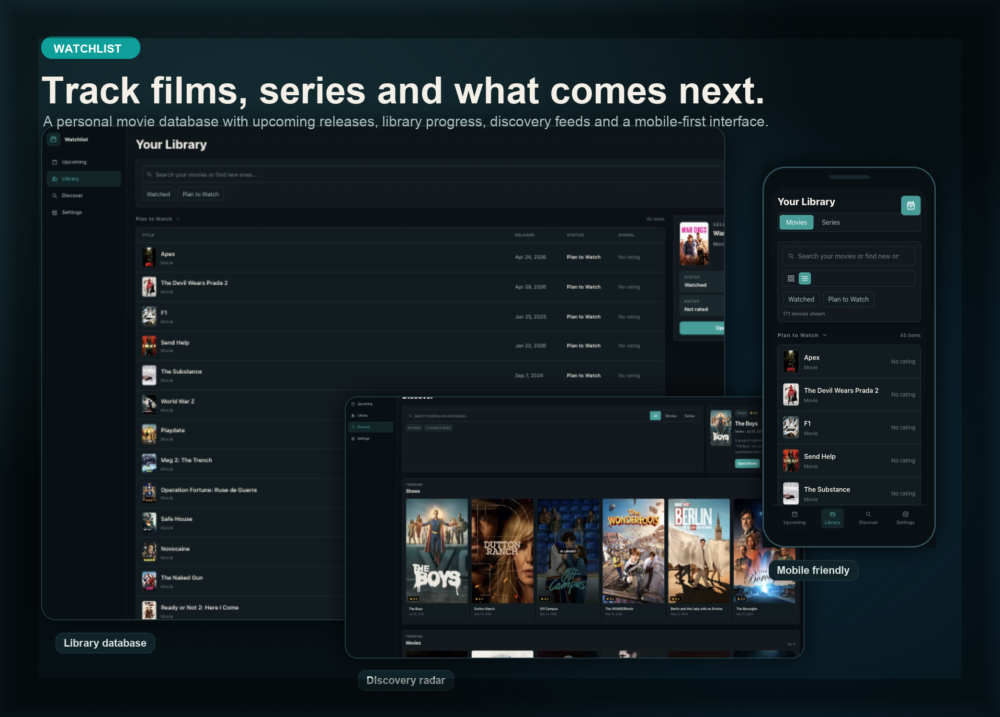
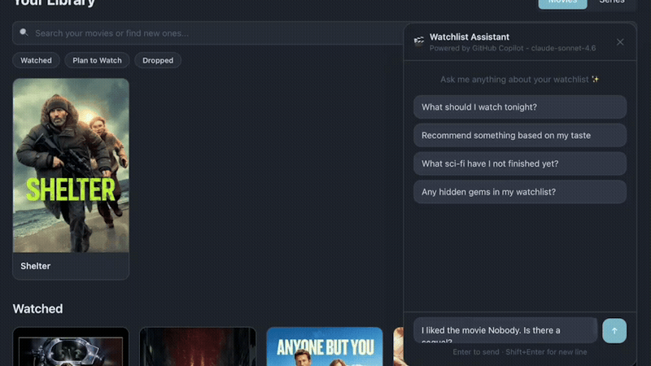

# MyWatchlist — Your Personal Movie Database

MyWatchlist is a responsive movie and series tracker for people who want more than a plain checklist. It gives you a polished personal library, release countdowns, discovery feeds, series progress, streaming availability, and an AI assistant that understands what is already in your watchlist.



## Why Use It?

Most watchlist apps are either too generic or too noisy. MyWatchlist is built for a simple personal workflow:

- keep track of what you watched, what you are watching, and what you still want to see
- browse upcoming movies and series with clear release countdowns
- maintain ratings, notes, and episode progress in one local database
- discover trending and anticipated titles from TMDB
- ask an AI assistant for recommendations based on your actual library
- use the same experience comfortably on desktop and mobile

## Highlights

### A Library That Feels Like a Database

Track movies and series with `watched`, `watching`, and `plan_to_watch` statuses. Switch between poster cards and a denser database-style list, keep personal ratings and notes, and continue series from your last watched episode.

### Release Planning

Upcoming movies and series are pulled into a dedicated release view with countdown badges, so your watchlist doubles as a lightweight premiere calendar.

### Discovery Radar

The Discover page surfaces trending and anticipated titles from TMDB, shows what is already in your library, and keeps search/filter controls close to the content.

### Rich Detail Pages

Each title gets a full detail page with poster and backdrop artwork, metadata, cast and crew, trailers, watch providers, and library actions.

### AI Watch Assistant

The built-in chat can recommend movies and series using your own library as context. It can search live TMDB data, inspect title details, find similar content, and avoid suggesting things you already track.

### Mobile-First UI

The app is designed to work well on a phone, with touch-friendly controls, bottom navigation, compact list views, and responsive layouts.

## Feature Overview

| Area | What You Can Do |
|------|------------------|
| Library | Track movies and series, filter by status, search locally or on TMDB, add ratings and notes |
| Series Progress | Store current season/episode, mark episodes watched, generate episode recaps |
| Upcoming | See release countdowns for unreleased movies and upcoming series episodes |
| Discover | Browse trending and anticipated movies/series with library status overlays |
| Details | View metadata, cast, crew, videos, watch providers, and library controls |
| AI Assistant | Ask for recommendations, similar titles, actor-based searches, and library-aware suggestions |
| Import / Export | Back up and restore your full local library as JSON |
| Themes | Switch between several dark and light visual themes |

## Tech Stack

**Frontend**
- React + TypeScript + Vite
- Tailwind CSS v4
- TanStack Query (React Query)
- React Router v7

**Backend**
- Node.js + Express
- better-sqlite3 (SQLite) for local persistence
- GitHub Copilot SDK for AI chat
- Zod for schema validation

**Data & Integrations**
- TMDB for movie and series metadata
- TVMaze for episode recap source summaries
- GitHub Copilot SDK for the default AI assistant
- OpenRouter BYOK support as an optional model provider

## Getting Started

```bash
# 1. Install dependencies
npm install

# 2. Create your environment file
cp .env.example .env

# 3. Add the required values to .env
# VITE_TMDB_API_TOKEN=your_tmdb_v4_read_token
# GH_Token=your_github_token_for_copilot_sdk

# 4. Start the app
npm run dev
```

`npm run dev` starts both the Vite frontend and the Express backend. The frontend runs through Vite, and the backend exposes the REST API, AI chat endpoints, and MCP server.

## Configuration

Minimum environment values:

| Variable | Required | Purpose |
|----------|----------|---------|
| `VITE_TMDB_API_TOKEN` | Yes | TMDB v4 read token for search, discovery, detail pages, and artwork |
| `GH_Token` | Yes | Required by the GitHub Copilot SDK chat server |

Inside the app, use Settings to configure:

- country/region for watch providers
- spoiler visibility
- episode recap availability
- cover size
- visual theme
- preferred streaming services
- optional OpenRouter BYOK models

## Available Scripts

| Command | Description |
|---------|-------------|
| `npm run dev` | Start frontend and backend together |
| `npm run dev:server` | Start only the Express backend |
| `npm run build` | Type-check and build the production frontend |
| `npm run lint` | Run ESLint |
| `npm run test` | Run Playwright end-to-end tests |

## MCP Server (Model Context Protocol)

The app embeds an **MCP server** (`@modelcontextprotocol/sdk`) that exposes the movie database as tools for AI coding assistants (VS Code, OpenCode, Claude Desktop, etc.). It runs in the same Express process via SSE transport.

**Endpoints:**

| Method | Path | Description |
|--------|------|-------------|
| `GET` | `/mcp` | SSE connection — establishes an MCP session |
| `POST` | `/mcp/messages?sessionId=...` | Receive tool call requests |

**MCP Tools:**

| Tool | Parameters | Description |
|------|-----------|-------------|
| `search_library` | `query?`, `contentType?`, `status?` | Search local library by title, type, or status |
| `get_library_stats` | — | Total items, distribution by status/type, average rating |
| `get_watchlist` | — | All `plan_to_watch` items |
| `get_series_progress` | `tmdbId` | Series progress + watched episodes |
| `add_to_library` | `tmdbId`, `contentType`, `title`, `status`, ... | Add a movie/series |
| `update_rating` | `id`, `userRating?`, `notes?` | Update rating or notes |
| `toggle_episode` | `tmdbId`, `season`, `episode` | Mark episode watched/unwatched |
| `get_item_details` | `tmdbId`, `contentType` | Library info + TMDB details (cast, genres, runtime) |
| `search_actor_library` | `name`, `type?` | Search actor credits via TMDB, cross-referenced with your library |

**Connecting from VS Code / OpenCode:**

Add to `.vscode/mcp.json` or `opencode.json`:

```json
{
  "servers": {
    "movie-tracker": {
      "type": "remote",
      "url": "http://localhost:3001/mcp",
      "enabled": true
    }
  }
}
```

## AI Assistant

The watch assistant is built on the [`@github/copilot-sdk`](https://www.npmjs.com/package/@github/copilot-sdk) package. It receives your local library as context, streams answers back into the UI, and can call live TMDB tools when it needs fresh title data.



Useful prompts include:

- "Recommend a movie based on what I rated highly."
- "Find something similar to Nobody, but not already in my library."
- "What should I watch next from my plan-to-watch list?"
- "Show me recent movies with this actor."

Key technical integration points:

- **Session creation** (`POST /api/chat/session`) — creates a `CopilotSession` with the user's full library injected as system context, so the model can give personalised recommendations without hallucinating titles already in the watchlist.
- **Streaming responses** (`POST /api/chat/message`) — uses `session.on('assistant.message_delta', ...)` to stream tokens to the client in real time.
- **Tool use** (`server/tools.ts`) — the session is configured with TMDB tools defined via `defineTool` and Zod schemas. The model calls these automatically to fetch live data instead of relying on stale training data:

  | Tool                 | Parameters                                            | Description                                                                                                                                 |
  | -------------------- | ----------------------------------------------------- | ------------------------------------------------------------------------------------------------------------------------------------------- |
  | `searchTMDB`         | `query: string`, `type: "movie" \| "tv"`              | Search for movies or TV series by title/keywords. Returns up to 6 results with ID, title, overview, release date, vote average, and genres. |
  | `getTMDBDetails`     | `id: number`, `type: "movie" \| "tv"`                 | Fetch full metadata for a title by TMDB ID, including genres, tagline, runtime, status, and top 5 cast members.                             |
  | `getSimilar`         | `id: number`, `type: "movie" \| "tv"`                 | Get up to 8 titles similar to a given TMDB ID. Useful for franchise and sequel exploration.                                                 |
  | `getRecommendations` | `id: number`, `type: "movie" \| "tv"`                 | Get up to 8 personalised TMDB recommendations based on a specific title.                                                                    |
  | `searchPerson`       | `name: string`                                        | Search for an actor, director, or crew member by name. Returns TMDB person ID, department, and known-for titles.                            |
  | `getPersonCredits`   | `personId: number`, `type: "movie" \| "tv" \| "both"` | Retrieve up to 20 most recent movie and/or TV credits for a person by their TMDB person ID.                                                 |

### Episode Recap

The Episode Recap feature (`POST /api/recap/episode`) uses a separate, simpler SDK integration — **1 premium request per recap as it uses Claude Sonnet 4.6**:

1. The server fetches the episode summary from the free [TVMaze REST API](https://www.tvmaze.com/api).
2. A single `createSession` + `sendAndWait` call rewrites the raw summary into a polished recap paragraph, with `streaming: true` so tokens are forwarded to the browser via SSE as they arrive.

## Project Structure

```
src/
├── api/          # TMDB API client + React Query hooks
├── db/           # Data models + REST API hooks (library, progress, episodes)
├── components/
│   ├── layout/   # AppShell (top/bottom nav)
│   ├── ui/       # Card, CardGrid, SearchBar, Filters, etc.
│   └── detail/   # HeroBanner, Overview, CastCrew, WatchProviders
├── pages/        # Route-level pages
├── hooks/        # useCountdown, useDebounce, useSettings
└── utils/        # Date helpers, image URL builders, constants

server/
├── index.ts      # Express app + REST API routes + Copilot SDK chat & recap endpoints
├── db.ts         # better-sqlite3 database setup, schema, and prepared statements
├── tools.ts      # Copilot SDK tool definitions (TMDB search, details, recommendations)
└── mcp-server.ts # MCP server with SSE transport + database tools for AI assistants

data/
└── movie-tracker.db  # SQLite database file (auto-created on first run)
```
